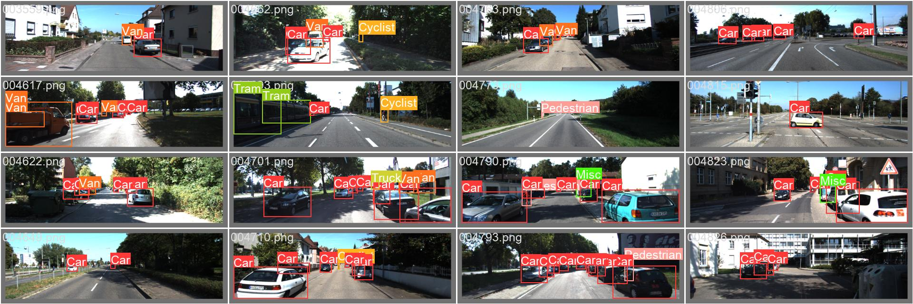

# Oject Detection with YOLOv8 Finetuned for KITTI

- Dataset Original: [https://www.cvlibs.net/datasets/kitti/index.php](https://www.cvlibs.net/datasets/kitti/index.php)
- Dataset Kaggle: [https://www.kaggle.com/datasets/klemenko/kitti-dataset](https://www.kaggle.com/datasets/klemenko/kitti-dataset)
- YOLOv8n: [https://github.com/ultralytics/ultralytics](https://github.com/ultralytics/ultralytics)

- KITTI to YOLO format conversion: [kitti-data-yolo-conversion.ipynb](./kitti-data-yolo-conversion.ipynb)
- Finetuning: [kitti-data-yolo-conversion.ipynb](./kitti-data-yolo-conversion.ipynb)
